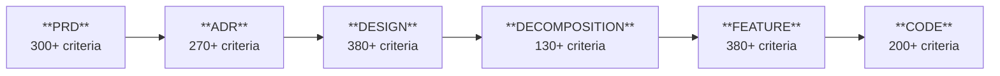

# Constructor Studio SDLC Quick Start

**Learn Constructor Studio SDLC in 10 minutes with real prompts and examples**

Constructor Studio SDLC works through the `cf-studio` skill (alias: `cf`) — enable it with `cf-studio on` and use natural language prompts prefixed with `cf-studio` (or the `cf` alias). The skill handles artifact discovery, template loading, validation, and traceability automatically. This kit also brings three kit-specific workflows invoked as `cf-sdlc-pr-review`, `cf-sdlc-pr-status`, and `cf-sdlc-migrate-openspec`.

---

## What You'll Learn

1. **Exact prompts to type** — copy-paste into your AI chat
2. **Complete pipeline** — from requirements to validated code
3. **Reverse engineering** — create artifacts from existing code
4. **Working with existing docs** — import what you already have

---

## The Pipeline

Constructor Studio SDLC = **Design First, Code Second**

| Artifact | Purpose |
|----------|---------|
| **PRD** | Product requirements — actors, capabilities, requirements, use cases, constraints |
| **ADR** | Architecture Decision Record — context, options, decision, consequences |
| **DESIGN** | Technical architecture — components, interfaces, data models, sequences |
| **DECOMPOSITION** | Feature breakdown — ordered implementation units with dependencies |
| **FEATURE** | Feature acceptance criteria, flows, algorithms, edge cases, definitions of done |
| **CODE** | Implementation — tagged with `@cpt-*` markers for traceability |

**Key principle**: If code contradicts design, fix design first, then regenerate code.

Learn what each artifact means: [TAXONOMY.md](TAXONOMY.md)

---

## Getting Started

| Prompt | What happens |
|--------|--------------|
| `cf-studio on` | Enables Constructor Studio mode, discovers config, loads project context |
| `cf-studio init` | Creates the Constructor Studio config directory (path stored as `cf-studio-path`), initializing `.core/`, `.gen/`, `config/` and `artifacts.toml` |
| `cf-studio show pipeline` | Displays current artifact hierarchy and validation status |

**Customizing artifact locations:**

| Prompt | What happens |
|--------|--------------|
| `cf-studio set artifacts_dir to docs/design/` | Changes default base directory for new artifacts |
| `cf-studio register PRD at docs/requirements/product-requirements.md` | Registers existing file as PRD artifact |
| `cf-studio move PRD to docs/requirements/PRD.md` | Moves artifact and updates registry |
| `cf-studio show artifact locations` | Displays current paths from `artifacts.toml` |

---

## Example Prompts — Greenfield Project

**PRD — Product Requirements**

| Prompt | What the agent does |
|--------|---------------------|
| `cf-studio make PRD` | Generates PRD interactively, asking for context |
| `cf-studio make PRD for task management API` | Generates PRD with actors, requirements, flows |
| `cf-studio draft PRD from README` | Creates PRD draft from existing README |
| `cf-studio extend PRD with notifications` | Adds new capability to existing PRD |
| `cf-studio validate PRD` | Full validation (300+ criteria) |
| `cf-studio validate PRD semantic` | Semantic validation only (completeness, clarity) |
| `cf-studio validate PRD structural` | Structural validation only (format, IDs, template) |
| `cf-studio validate PRD refs` | Check cross-references to other artifacts |

**ADR — Architecture Decision Records**

| Prompt | What the agent does |
|--------|---------------------|
| `cf-studio make ADR for PostgreSQL` | Creates ADR for technology choice |
| `cf-studio make ADR for REST vs GraphQL` | Creates ADR comparing approaches |
| `cf-studio draft ADR from discussion` | Extracts decision from conversation |
| `cf-studio list ADRs` | Shows all ADRs with status |
| `cf-studio validate ADR` | Validates all ADRs (270+ criteria each) |
| `cf-studio validate ADR 0001` | Validates specific ADR by number |
| `cf-studio validate ADR semantic` | Semantic validation (rationale quality) |
| `cf-studio validate ADR structural` | Structural validation (format, sections) |

**DESIGN — Technical Architecture**

| Prompt | What the agent does |
|--------|---------------------|
| `cf-studio make DESIGN` | Creates DESIGN from PRD interactively |
| `cf-studio make DESIGN from PRD` | Transforms PRD into architecture |
| `cf-studio extend DESIGN with caching layer` | Adds new component to existing DESIGN |
| `cf-studio update DESIGN components` | Updates component section |
| `cf-studio validate DESIGN` | Full validation (380+ criteria) |
| `cf-studio validate DESIGN semantic` | Semantic validation (consistency, completeness) |
| `cf-studio validate DESIGN structural` | Structural validation (format, IDs) |
| `cf-studio validate DESIGN refs` | Check references to PRD/ADR |

**DECOMPOSITION — Feature Breakdown**

| Prompt | What the agent does |
|--------|---------------------|
| `cf-studio decompose` | Creates DECOMPOSITION interactively |
| `cf-studio decompose into features` | Creates ordered feature list with dependencies |
| `cf-studio decompose by capability` | Groups features by business capability |
| `cf-studio decompose by layer` | Groups features by technical layer |
| `cf-studio add feature to decomposition` | Adds new feature entry |
| `cf-studio validate DECOMPOSITION` | Full validation (130+ criteria) |
| `cf-studio validate DECOMPOSITION semantic` | Semantic validation (coverage, dependencies) |
| `cf-studio validate DECOMPOSITION structural` | Structural validation (format, IDs) |

**FEATURE — Feature Specification**

| Prompt | What the agent does |
|--------|---------------------|
| `cf-studio make FEATURE for auth` | Creates feature design for auth |
| `cf-studio make FEATURE for task-crud` | Creates detailed feature design |
| `cf-studio draft FEATURE from code` | Reverse-engineers feature from implementation |
| `cf-studio extend FEATURE auth with MFA` | Adds scenario to existing feature |
| `cf-studio validate FEATURE auth` | Full validation (380+ criteria) |
| `cf-studio validate FEATURE auth semantic` | Semantic validation (flows, edge cases) |
| `cf-studio validate FEATURE auth structural` | Structural validation (CDSL format, IDs) |
| `cf-studio validate FEATURE auth refs` | Check references to DESIGN/DECOMPOSITION |

**CODE — Implementation**

| Prompt | What the agent does |
|--------|---------------------|
| `cf-studio implement {slug}` | Generates code from FEATURE |
| `cf-studio implement {slug} step by step` | Implements with user confirmation |
| `cf-studio implement {slug} tests first` | Generates tests first, then code |
| `cf-studio implement {slug} flow {flow-id}` | Implements specific flow only |
| `cf-studio implement {slug} api` | Implements API layer only |
| `cf-studio implement {slug} tests` | Generates tests only |
| `cf-studio continue implementing {slug}` | Continues partial implementation |
| `cf-studio implement {slug} remaining` | Implements only unimplemented parts |
| `cf-studio sync code with FEATURE {slug}` | Updates code to match FEATURE |
| `cf-studio add markers to {path}` | Adds markers to existing code |
| `cf-studio add markers for {slug}` | Adds markers matching FEATURE |

**CODE — Validation**

| Prompt | What the agent does |
|--------|---------------------|
| `cf-studio validate code` | Validates all code markers |
| `cf-studio validate code for {slug}` | Validates specific feature |
| `cf-studio validate code coverage` | Reports implementation coverage % |
| `cf-studio validate code coverage for {slug}` | Coverage for specific feature |
| `cf-studio validate code orphans` | Finds orphaned markers |
| `cf-studio validate code refs` | Validates marker references |
| `cf-studio validate code markers` | Checks marker format |
| `cf-studio list code markers` | Lists all markers |
| `cf-studio list code markers for {slug}` | Lists markers for feature |
| `cf-studio show uncovered flows` | Lists flows without code |
| `cf-studio compare code to FEATURE {slug}` | Shows drift from feature |
| `cf-studio find missing implementations` | Lists unimplemented elements |

**Pipeline & Cross-Artifact**

| Prompt | What the agent does |
|--------|---------------------|
| `cf-studio validate all` | Validates entire hierarchy |
| `cf-studio validate refs` | Checks all cross-references |
| `cf-studio show pipeline` | Displays artifact status |
| `cf-studio coverage report` | Summary of implementation coverage |

---

## Example Prompts — Brownfield Project

**Reverse-engineer from code**

| Prompt | What the agent does |
|--------|---------------------|
| `cf-studio reverse PRD from codebase` | Extracts requirements from existing implementation |
| `cf-studio reverse DESIGN from src/` | Documents current architecture from code |
| `cf-studio reverse FEATURE from src/auth/` | Creates FEATURE from auth module |
| `cf-studio reverse FEATURE auth from code` | Same, using feature slug |
| `cf-studio analyze src/api/` | Systematic code analysis with checklist |

**Import from existing docs**

| Prompt | What the agent does |
|--------|---------------------|
| `cf-studio make PRD from docs/requirements.txt` | Extracts requirements into PRD format |
| `cf-studio make PRD from README` | Creates PRD from project README |
| `cf-studio make PRD from this conversation` | Creates PRD from stakeholder discussion |
| `cf-studio import OpenAPI as DESIGN` | Converts API spec into DESIGN |
| `cf-studio import db-schema.sql as DESIGN data model` | Extracts data model from SQL |
| `cf-studio convert user-stories.md to PRD` | Transforms user stories to PRD |

**Sync and compare**

| Prompt | What the agent does |
|--------|---------------------|
| `cf-studio compare DESIGN to code` | Shows drift between design and implementation |
| `cf-studio sync DESIGN from code` | Updates DESIGN to match current code |
| `cf-studio diff FEATURE auth` | Shows changes since last validation |

---

## Example Prompts — Evolution & Maintenance

**Extend artifacts**

| Prompt | What the agent does |
|--------|---------------------|
| `cf-studio extend PRD with payments` | Adds capability to PRD |
| `cf-studio extend DESIGN with caching` | Adds component to DESIGN |
| `cf-studio extend FEATURE auth with MFA` | Adds scenario to feature |
| `cf-studio add feature billing to decomposition` | Adds feature entry |

**Update and propagate**

| Prompt | What the agent does |
|--------|---------------------|
| `cf-studio update PRD requirements` | Updates requirements section |
| `cf-studio propagate PRD changes to DESIGN` | Updates DESIGN from PRD changes |
| `cf-studio sync DESIGN from code` | Updates DESIGN to match implementation |

**Impact analysis**

| Prompt | What the agent does |
|--------|---------------------|
| `cf-studio show impact of removing FR-AUTH-002` | Traces downstream references |
| `cf-studio show impact of changing component auth` | Shows affected artifacts |
| `cf-studio deprecate feature user-import` | Marks deprecated across artifacts |

**Refactoring**

| Prompt | What the agent does |
|--------|---------------------|
| `cf-studio refactor component auth-service` | Updates DESIGN and FEATUREs |
| `cf-studio rename feature billing to payments` | Renames across all artifacts |
| `cf-studio split feature payments` | Creates sub-features |
| `cf-studio merge features billing and invoicing` | Combines features |

---

## Example Prompts — Review & Quality

**Validation modes**

| Prompt | What the agent does |
|--------|---------------------|
| `cf-studio validate {ARTIFACT}` | Full validation (structural + semantic) |
| `cf-studio validate {ARTIFACT} semantic` | Semantic only (content quality, completeness) |
| `cf-studio validate {ARTIFACT} structural` | Structural only (format, IDs, template compliance) |
| `cf-studio validate {ARTIFACT} refs` | Cross-reference validation only |
| `cf-studio validate {ARTIFACT} quick` | Fast check (critical issues only) |
| `cf-studio validate all` | Full validation of entire pipeline |
| `cf-studio validate all semantic` | Semantic validation across all artifacts |

**Traceability queries**

| Prompt | What the agent does |
|--------|---------------------|
| `cf-studio trace FR-AUTH-001` | Shows path: PRD → DESIGN → FEATURE → CODE |
| `cf-studio trace feature auth` | Shows all references to auth feature |
| `cf-studio find orphans` | Lists IDs with no upstream/downstream refs |
| `cf-studio find orphan code` | Code markers referencing non-existent IDs |
| `cf-studio find orphan requirements` | Requirements not covered by DESIGN |
| `cf-studio list unimplemented` | Features without code coverage |
| `cf-studio coverage report` | Implementation coverage by artifact |
| `cf-studio show refs for DESIGN` | All references in DESIGN artifact |

**Review prompts**

| Prompt | What the agent does |
|--------|---------------------|
| `cf-studio review PRD` | Deep review with 300+ criteria |
| `cf-studio review DESIGN for consistency` | Checks for internal contradictions |
| `cf-studio review FEATURE auth for completeness` | Validates edge cases and error handling |
| `cf-studio review PR #42 against FEATURE` | Checks PR implements feature items |
| `cf-studio review code for auth` | Reviews implementation quality |

---

## Live Example

[Taskman (Constructor Studio example project)](https://github.com/constructorfabric/constructor-studio-examples-taskman) — a complete task management project with the full Constructor Studio artifact set and implementation.

---

## Guides by Scenario

| Scenario | Guide | Key Point |
|----------|-------|-----------|
| **Greenfield** | [GREENFIELD.md](GREENFIELD.md) | Start from PRD, work down to code |
| **Brownfield** | [BROWNFIELD.md](BROWNFIELD.md) | Start anywhere — code-only, bottom-up, or full |
| **Modular monolith** | [MONOLITH.md](MONOLITH.md) | Project-level + module-level artifacts |

**Brownfield flexibility**: No required order. Start with code-only (checklist benefits), add FEATURE designs for complex areas, add DESIGN later. Or go full top-down. Your choice.

## Reference

- Artifact taxonomy: [TAXONOMY.md](TAXONOMY.md)
- Kit overview: [README.md](../README.md)
