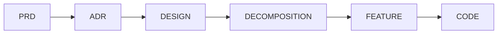

# SDLC Kit Taxonomy

Canonical taxonomy for the SDLC kit.

This guide defines what each SDLC artifact/code kind is, how it transforms into the next layer, how it traces to upstream IDs, and which files define templates/rules/examples.

## Dependency chain

In the SDLC kit, artifacts form a strict chain:

## Kinds

### PRD

**Purpose**: product intent and problem definition.

**Defines IDs** (examples):
- Actors: `cpt-{system}-actor-{slug}`
- Functional requirements: `cpt-{system}-fr-{slug}`
- Non-functional requirements: `cpt-{system}-nfr-{slug}`
- Use cases: `cpt-{system}-usecase-{slug}`

**Transforms into**:
- **DESIGN**: design drivers reference PRD FR/NFR IDs and describe architectural responses.
- **DECOMPOSITION**/**FEATURE**: downstream layers must keep referencing the same PRD IDs they cover.

**Traceability**:
- PRD is the root of many downstream references (FR/NFR coverage).

**Validation**:
- Template structure + ID formats
- Cross-reference validity (downstream references must resolve)

**Files**:
- Template: [kits/sdlc/artifacts/PRD/template.md](../artifacts/PRD/template.md)
- Rules: [kits/sdlc/artifacts/PRD/rules.md](../artifacts/PRD/rules.md)
- Checklist: [kits/sdlc/artifacts/PRD/checklist.md](../artifacts/PRD/checklist.md)
- Examples: [kits/sdlc/artifacts/PRD/examples/](../artifacts/PRD/examples/)

### ADR

**Purpose**: record a single architecture decision (context → options → outcome → consequences).

**Defines IDs**:
- ADR record: `cpt-{system}-adr-{slug}`

**Transforms into**:
- **DESIGN**: design drivers reference ADR IDs and incorporate decisions.

**Traceability**:
- ADR IDs are referenced from DESIGN (and optionally from FEATURE context).

**Validation**:
- Template structure + ID format + required Meta fields

**Files**:
- Template: [kits/sdlc/artifacts/ADR/template.md](../artifacts/ADR/template.md)
- Rules: [kits/sdlc/artifacts/ADR/rules.md](../artifacts/ADR/rules.md)
- Checklist: [kits/sdlc/artifacts/ADR/checklist.md](../artifacts/ADR/checklist.md)
- Examples: [kits/sdlc/artifacts/ADR/examples/](../artifacts/ADR/examples/)

### DESIGN

**Purpose**: the technical architecture that satisfies PRD requirements and ADR decisions.

**References upstream IDs**:
- PRD FR/NFR IDs (as drivers)
- ADR IDs (as decision drivers)

**Defines IDs** (examples):
- Principles: `cpt-{system}-principle-{slug}`
- Constraints: `cpt-{system}-constraint-{slug}`
- Components: `cpt-{system}-component-{slug}`
- Sequences: `cpt-{system}-seq-{slug}`
- DB tables (optional): `cpt-{system}-dbtable-{slug}`

**Transforms into**:
- **DECOMPOSITION**: features are defined as work units that cover specific design elements (principles/constraints/components/etc.).

**Traceability**:
- DESIGN references PRD/ADR.
- DECOMPOSITION/FEATURE must keep referencing the DESIGN IDs they implement/cover.

**Validation**:
- Template structure + ID formats
- Cross-reference validity for all referenced IDs

**Files**:
- Template: [kits/sdlc/artifacts/DESIGN/template.md](../artifacts/DESIGN/template.md)
- Rules: [kits/sdlc/artifacts/DESIGN/rules.md](../artifacts/DESIGN/rules.md)
- Checklist: [kits/sdlc/artifacts/DESIGN/checklist.md](../artifacts/DESIGN/checklist.md)
- Examples: [kits/sdlc/artifacts/DESIGN/examples/](../artifacts/DESIGN/examples/)

### DECOMPOSITION

**Purpose**: turn DESIGN into a set of implementable features with explicit coverage links.

**Defines IDs**:
- Overall status tracker: `cpt-{system}-status-overall`
- Features: `cpt-{system}-feature-{slug}`

**References upstream IDs**:
- PRD FR/NFR IDs (requirements covered)
- DESIGN IDs (principles/constraints/components/sequences/data)

**Transforms into**:
- **FEATURE**: each decomposition entry links to a feature design document (`features/`).

**Traceability**:
- A feature entry is the upstream anchor for a FEATURE design (FEATURE references the `feature` ID).

**Validation**:
- Template structure + feature link format
- Cross-reference validity for all coverage references

**Files**:
- Template: [kits/sdlc/artifacts/DECOMPOSITION/template.md](../artifacts/DECOMPOSITION/template.md)
- Rules: [kits/sdlc/artifacts/DECOMPOSITION/rules.md](../artifacts/DECOMPOSITION/rules.md)
- Checklist: [kits/sdlc/artifacts/DECOMPOSITION/checklist.md](../artifacts/DECOMPOSITION/checklist.md)
- Examples: [kits/sdlc/artifacts/DECOMPOSITION/examples/](../artifacts/DECOMPOSITION/examples/)

### FEATURE

**Purpose**: implementable behavior design for a single feature, with definition-of-done and implementable steps.

**References upstream IDs**:
- The decomposition feature ID: `cpt-{system}-feature-{slug}`
- PRD actor IDs (actors)
- PRD FR/NFR IDs (coverage)
- DESIGN IDs (principles/constraints/components/sequences/data)

**Defines IDs** (SDLC code-traceable kinds):
- Flow: `cpt-{system}-flow-{feature-slug}-{slug}`
- Algorithm: `cpt-{system}-algo-{feature-slug}-{slug}`
- State machine: `cpt-{system}-state-{feature-slug}-{slug}`
- Definition-of-done: `cpt-{system}-dod-{feature-slug}-{slug}`

These IDs are typically marked `to_code="true"` in the template, which makes them subject to code coverage checks.

**Transforms into**:
- **CODE**: implement flows/algorithms/states/requirements in source code and tag implementation with Cyber Constructor markers.

**Traceability**:
- FEATURE IDs are referenced from code using scope markers: `@cpt-{kind}:{cpt-id}:p{N}`.
- Instruction-level implementations can be wrapped with block markers:
  - `@cpt-begin:{cpt-id}:p{N}:inst-{local}` / `@cpt-end:...`

Phase tokens:
- FEATURE step lines use `p{N}` (as part of the step formatting).
- Code markers use `p{N}` (as part of marker syntax).

**Validation**:
- Template structure + ID formats
- Cross-reference validity for all referenced IDs
- Code coverage and orphan checks via `validate`

**Files**:
- Template: [kits/sdlc/artifacts/FEATURE/template.md](../artifacts/FEATURE/template.md)
- Rules: [kits/sdlc/artifacts/FEATURE/rules.md](../artifacts/FEATURE/rules.md)
- Checklist: [kits/sdlc/artifacts/FEATURE/checklist.md](../artifacts/FEATURE/checklist.md)
- Example: [kits/sdlc/artifacts/FEATURE/examples/](../artifacts/FEATURE/examples/)

### CODE

**Purpose**: the implementation layer validated against FEATURE IDs.

**Defines**:
- No new Cyber Constructor IDs are defined in code. Code only references IDs that exist in artifacts.

**Traceability**:
- Mark code with Cyber Constructor markers as specified in `{cf-constructor-path}/.core/requirements/traceability.md`.

**Validation**:
- Structure and pairing checks + cross-validation + coverage checks via `validate`.
- Semantic code review criteria via SDLC codebase checklist.

**Files**:
- Rules: [kits/sdlc/codebase/rules.md](../codebase/rules.md)
- Checklist: [kits/sdlc/codebase/checklist.md](../codebase/checklist.md)

## CLI Commands

### Validation

| Command | What it validates |
|---------|-------------------|
| `cfc validate` | Artifacts against templates + cross-references + code markers (pairing, coverage, orphans) |
| `cfc validate-kits` | Kit package integrity — constraints, structure |
| `cfc validate-toc` | Table of contents correctness in markdown files |

> `validate-code` is a legacy alias for `validate` — use `cfc validate` for all validation.

### Traceability & Search

| Command | What it does |
|---------|--------------|
| `cfc list-ids` | Lists all IDs defined across artifacts |
| `cfc where-defined <id>` | Shows where an ID is defined |
| `cfc where-used <id>` | Shows where an ID is referenced |
| `cfc spec-coverage` | Measures code coverage by CDSL specification markers |
| `cfc toc` | Generates/updates table of contents in markdown files |
| `cfc info` | Shows Cyber Constructor configuration and project context |

Script path (for direct invocation): `python3 {cf-constructor-path}/.core/skills/cf-constructor/scripts/cfc.py <command>`

> All `cf-constructor ...` prompts in the guides above are **AI skill prompts** typed in the IDE chat. The `cfc` commands above are **CLI commands** run in the terminal.

## References

- [Code Quality Checklist](../codebase/checklist.md) — code review criteria
- [Code Rules](../codebase/rules.md) — code generation and validation rules